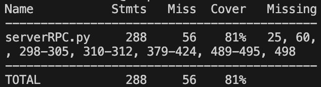
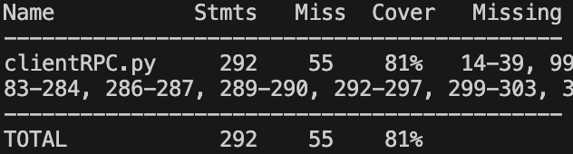

# Chat Application Documentation

## Table of Contents
- [Introduction](#introduction)
- [mySQL Setup](#mySQL-setup)
  - [Allow Remote Connections to MySQL](#Allow-Remote-Connections-to-MySQL)
- [Server Setup](#server-setup)
  - [Requirements](#requirements)
  - [Running the Server](#running-the-server)
- [Client Setup](#client-setup)
  - [Running the Client](#running-the-client)
  - [Using the Client](#using-the-client)
- [Features](#features)
- [Commands](#commands)
- [Testing] (#testing)

## Introduction
This is a simple chat application that consists of a **server** and a **client**. The server manages user authentication, messaging, and storing user messages. The client provides a graphical interface for users to communicate. The product features 2-fault tolerance and persistent storage. The database of choice is Postgres.

    
## Server Setup
### Running the Server
-  To run the RPC version, run 
   ```sh
   python serverRPC.py --host 10.250.52.124 --port 50000
   ```

### Running the Client
Note: Make sure you have tkinter installed. 
-  To run the RPC version, run 
   ```sh
   python clientRPC.py --host 10.250.52.124 --port 50000
   ```
3. A GUI window should appear for login, registration, and messaging.

### Using the Client
1. **Login or Register:**
   - On the welcome screen, choose "Login" or "Register".
   - If registering, enter a username and a strong password (must contain an uppercase letter, digit, and special character).
   - If logging in, enter your existing credentials.

2. **Messaging:**
   - Once logged in, you can send messages by typing `@username message`.
   - You can check unread messages by typing `check`.
   - Log off by typing `logoff`.
   
## Features
- **User Authentication:** Register and log in securely.
- **Messaging System:** Send direct messages to registered users.
- **Unread Messages:** Unread messages can be viewed upon login. 
    - If there is an overload of messages, the messages will be displayed in batches of 5. 
- **User Management:** Users can delete their last message or deactivate their account.

## Commands
| Command           | Description |
|------------------|-------------|
| `@username message` | Sends a direct message to a user. |
| `check` | Displays unread messages. |
| `logoff` | Logs out from the server. |
| `history` | See chat history with another user. |
| `search` | Lists all registered users. |
| `delete` | Deletes the last sent message. |
| `deactivate` | Permanently deletes your account. |

## Testing
### Server
ServerRPC:
```
python serverRPC.py --host 10.250.52.124 --port 50000
coverage run --source=serverRPC testServerRPC.py
coverage report -m
```


### Client 
ClientRPC:
```
  coverage run --source=clientRPC testClientRPC.py
  coverage report -m
```
