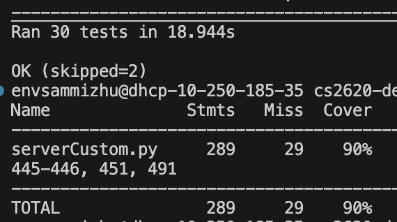
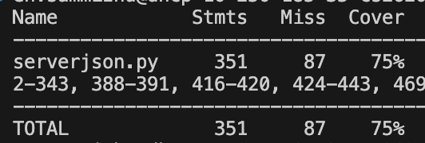
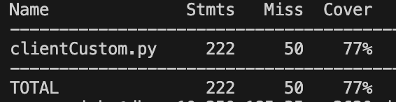
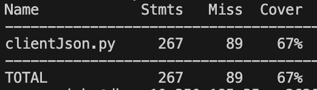

# Chat Application Documentation

## Table of Contents
- [Introduction](#introduction)
- [mySQL Setup](#mySQL-setup)
  - [Allow Remote Connections to MySQL](#Allow-Remote-Connections-to-MySQL)
- [Server Setup](#server-setup)
  - [Requirements](#requirements)
  - [Running the Server](#running-the-server)
- [Client Setup](#client-setup)
  - [Running the Client](#running-the-client)
  - [Using the Client](#using-the-client)
- [Features](#features)
- [Commands](#commands)
- [Testing] (#testing)

## Introduction
This is a simple chat application that consists of a **server** and a **client**. The server manages user authentication, messaging, and storing user messages. The client provides a graphical interface for users to communicate.

### mySQL Setup
Check to see that your mySQL is configured to run on any host (nonlocally). First run `lsof -i :3306`. You should expect to see
```
mysqld  19607 your-username   22u  IPv4 0xb60f146791366c7b      0t0  TCP *:mysql (LISTEN)
```
If it shows `127.0.0.1:mysql (LISTEN)`, MySQL is only allowing local connections. **Proceed to the next step to fix this.**
### Allow Remote Connections to MySQL
#### Modify the MySQL Configuration File
1. Open the MySQL config file: `nano /opt/homebrew/etc/my.cnf`
2. Change `bind-address = 127.0.0.1` to `bind-address = 0.0.0.0`
3. Save and exit (CTRL + X, then Y, then Enter).
4. Restart MySQL: `brew services restart mysql`
5. Check again: `lsof -i :3306`
If the output shows `*:mysql (LISTEN)`, MySQL is now accepting remote connections.

#### Grant Remote Access to a MySQL User
1. Log into MySQL `mysql -u root -p`
2. SELECT Host, User FROM mysql.user;
    - If root@% or root@your-hostname is missing, add them:
        ```
        CREATE USER 'root'@'%' IDENTIFIED BY '';
        GRANT ALL PRIVILEGES ON *.* TO 'root'@'%' WITH GRANT OPTION;
        FLUSH PRIVILEGES;
        EXIT;
        ```
        Note - replace '' with your password if you have one

**Optional:** If MySQL is still not accessible remotely, open port 3306 and run `sudo pfctl -f /etc/pf.conf -e`

#### Test Remote MySQL Connection
Run `mysql -h 10.250.185.35 -u root -p` and if successful, your MySQL now allows remote access!
    
## Server Setup
### Requirements
Ensure you have the following installed:
- Python 3.x
- Required Python libraries:
  ```sh
  pip install -r requirements.txt
  ```
- MySQL Database set up with a database named `db262`, and a `users` and `messages` table. First run, `mysql -u root -p db262 < db262.sql`
  to import the sql file. Then run `mysql -u root -p` to enter the sql terminal. Once in, run `USE db262` and then you can use regular sql commands to check your database. 

### Running the Server
There are two servers. One running with JSON and the other via a custom wire protocol. 
-  To run the JSON version, run 
   ```sh
   python serverJson.py --host 10.250.185.35 --port 50000
     ```
-  To run the custom wire protocol version, run 
   ```sh
   python serverCustom.py --host 10.250.185.35 --port 50000
   ```

### Running the Client
Note: Make sure you have tkinter installed. 
There are two clients. One running with JSON and the other via a custom wire protocol. 
Howver, if you run a JSON server, you must run a JSON client, vice versa.  
-  To run the JSON version, run 
   ```sh
   python clientJSON.py --host 10.250.185.35 --port 50000
     ```
-  To run the custom wire protocol version, run 
   ```sh
   python clientCustom.py --host 10.250.185.35 --port 50000
   ```
3. A GUI window should appear for login, registration, and messaging.

### Using the Client
1. **Login or Register:**
   - On the welcome screen, choose "Login" or "Register".
   - If registering, enter a username and a strong password (must contain an uppercase letter, digit, and special character).
   - If logging in, enter your existing credentials.

2. **Messaging:**
   - Once logged in, you can send messages by typing `@username message`.
   - You can check unread messages by typing `check`.
   - Log off by typing `logoff`.
   
## Features
- **User Authentication:** Register and log in securely.
- **Messaging System:** Send direct messages to registered users.
- **Unread Messages:** Unread messages can be viewed upon login. 
    - If there is an overload of messages, the messages will be displayed in batches of 5. 
- **User Management:** Users can delete their last message or deactivate their account.

## Commands
| Command           | Description |
|------------------|-------------|
| `@username message` | Sends a direct message to a user. |
| `check` | Displays unread messages. |
| `logoff` | Logs out from the server. |
| `search` | Lists all registered users. |
| `delete` | Deletes the last sent message. |
| `deactivate` | Permanently deletes your account. |

## Testing
### Server
ServerCustom:
```
coverage run --source=serverCustom testServerCustom.py
coverage report -m
```


ServerJSON:
```
coverage run --source=serverCustom testServerJSON.py
coverage report -m
```


### Client
ClientCustom:
```
coverage run --source=clientCustom testClientCustom.py
coverage report -m
```


ClientJSON:
```
coverage run --source=clientJson testClientJSON.py
coverage report -m
```
